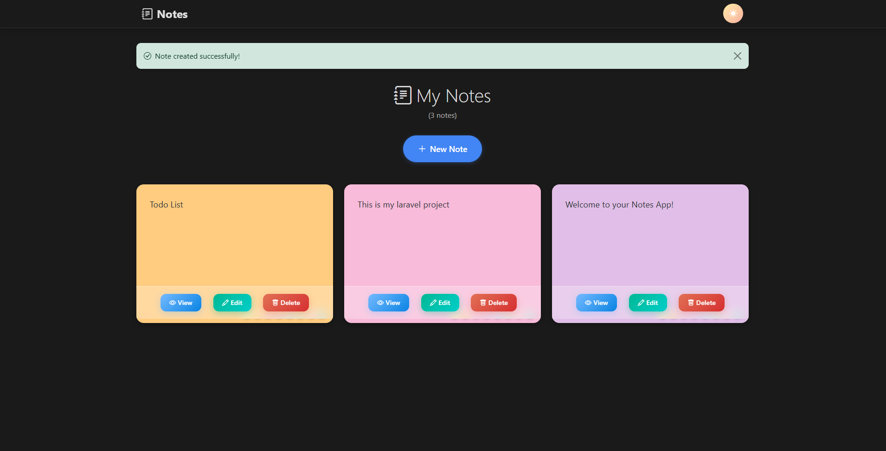

# 📝 Laravel Notes App

A beautiful, modern note-taking application built with Laravel 11 featuring a sleek design, dark mode toggle, and colorful note cards with smooth animations.


## ✨ Features

-   🎨 **Modern UI Design** - Clean, professional interface with smooth animations
-   🌙 **Dark Mode Toggle** - Switch between light and dark themes with persistent settings
-   🎯 **Colorful Note Cards** - 8 beautiful color options for organizing your notes
-   📱 **Responsive Design** - Works perfectly on desktop, tablet, and mobile devices
-   ⚡ **Real-time Color Picker** - Change note colors instantly with visual feedback
-   🔄 **Smooth Animations** - Enhanced user experience with CSS transitions and hover effects

## 🚀 Screenshots

### Light Mode

![Light Mode Dashboard]

_Clean and bright interface with colorful note cards_

### Dark Mode

![Dark Mode Dashboard]

_Beautiful dark theme with enhanced contrast_

### Note Creation

![Create Note]

_Simple and intuitive note creation form_

### Edit


### Mobile View


_Fully responsive design for mobile devices_

## 🛠️ Technologies Used

-   **Backend:** Laravel 11.x
-   **Frontend:** Bootstrap 5.3, Custom CSS
-   **Icons:** Bootstrap Icons
-   **JavaScript:** Vanilla JS with modern ES6+ features
-   **Styling:** Custom CSS with animations, Glassmorphism effects
-   **Storage:** Session-based (can be easily migrated to database)

## 📋 Requirements

-   PHP 8.4 or higher
-   Composer
-   Node.js and npm (optional, for asset compilation)

## 🔧 Installation

1. **Clone the repository**

    ```bash
    git clone https://github.com/yourusername/laravel-notes-app.git
    cd laravel-notes-app
    ```

2. **Install PHP dependencies**

    ```bash
    composer install
    ```

3. **Copy environment file**

    ```bash
    copy .env.example .env
    ```

4. **Generate application key**

    ```bash
    php artisan key:generate
    ```

5. **Start the development server**

    ```bash
    php artisan serve
    ```

6. **Open your browser**
    ```
    http://localhost:8000
    ```

## 🎮 Usage

### Creating Notes

-   Click the "New Note" button on the homepage
-   Write your note content in the text area
-   Click "Save Note" to store your note

### Managing Notes

-   **View:** Click the blue "View" button to see full note content
-   **Edit:** Click the green "Edit" button to modify your note
-   **Delete:** Click the red "Delete" button to remove a note

### Customizing Colors

-   Hover over any note card
-   Click on any of the 8 colored circles at the bottom
-   Your color choice is automatically saved

### Dark Mode

-   Click the moon icon in the top-right corner to enable dark mode
-   Click the sun icon to return to light mode
-   Your preference is saved automatically

pawan singh - ucontactpawan@gmail.com

Project Link: https://github.com/ucontactpawan/laravel-notes-app

---

⭐ If you like this project, please give it a star on GitHub!
